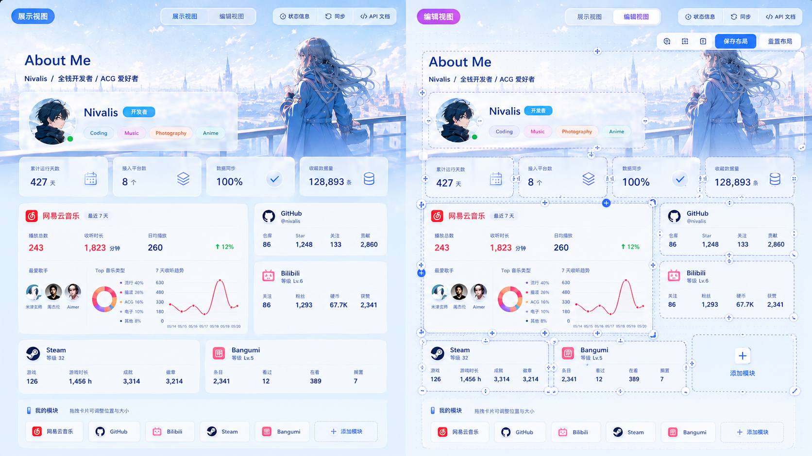
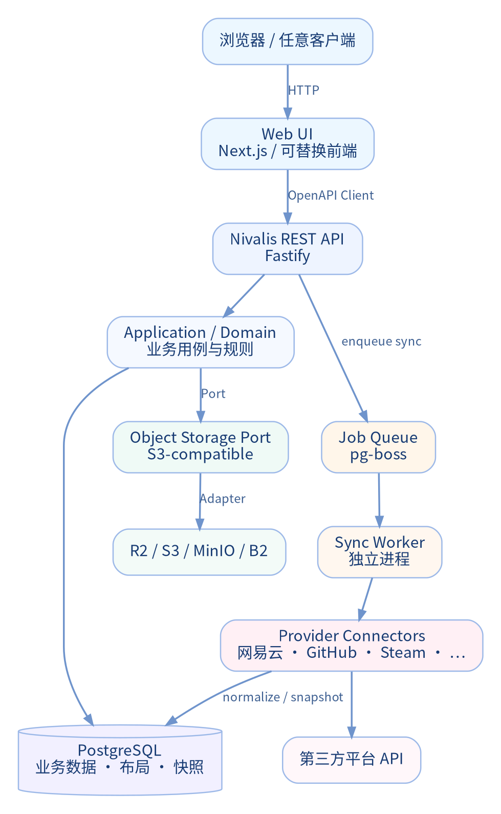
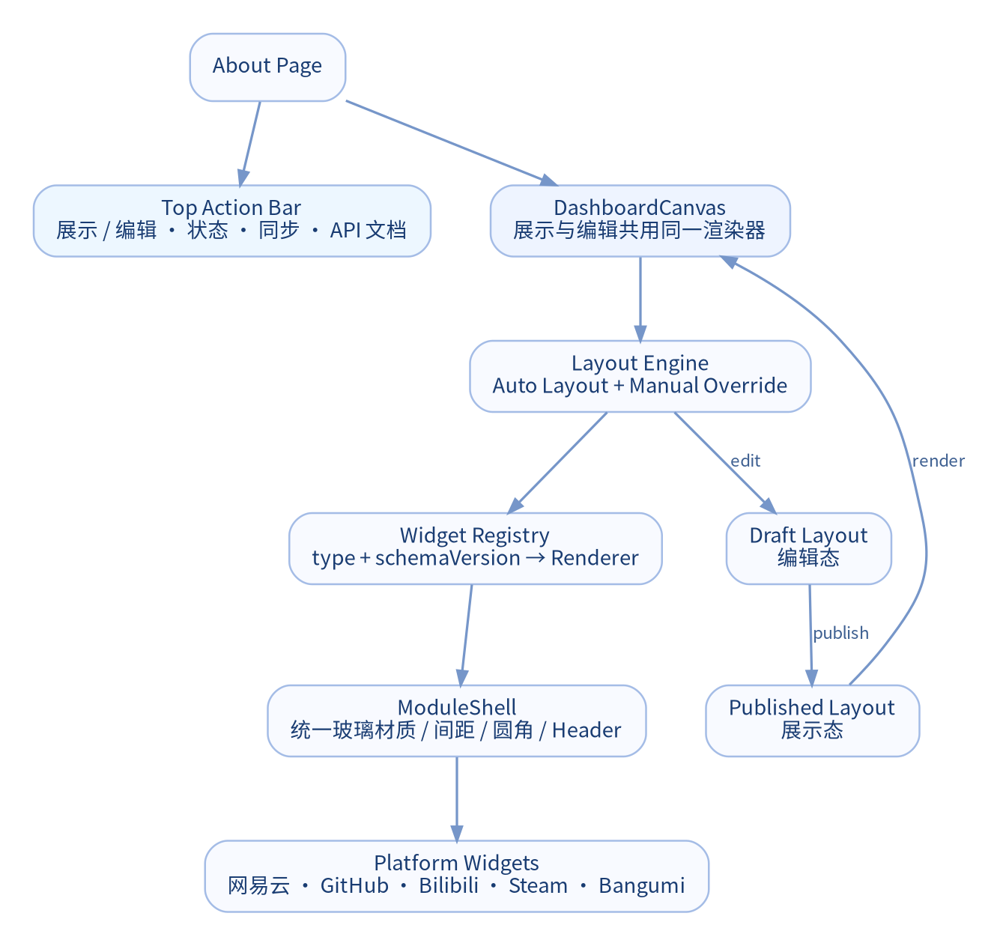
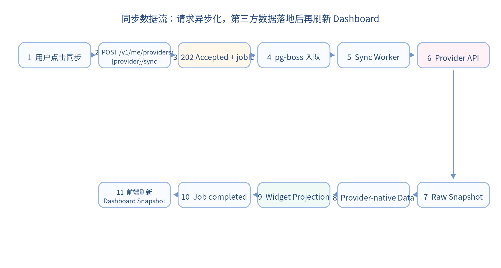
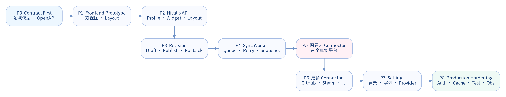

# Nivalis About Me 项目实现规范

**文档版本：** v0.1  
**状态：** Initial Implementation Baseline / 必要实现参考  
**日期：** 2026-08-23  
**适用范围：** Nivalis About Me Web、独立 API、同步 Worker、第三方平台 Connector、配置与部署  

> 本规范是项目实现的必要参考。除非在后续 ADR（Architecture Decision Record）中明确变更，本规范中标记为 **MUST / MUST NOT** 的条目应视为强制约束。

---

## 0. 规范用语

- **MUST / MUST NOT**：强制要求；违反即视为架构偏离。
- **SHOULD / SHOULD NOT**：默认应遵循；如偏离需要在 PR/ADR 中说明原因。
- **MAY**：可选实现，不构成兼容性承诺。
- **Provider**：网易云音乐、GitHub、Bilibili、Steam、Bangumi 等外部数据源。
- **Widget / Module**：主页中的可编排数据模块。
- **Connector**：隔离 Provider 差异的后端适配器。
- **Projection**：面向 Widget 展示优化后的读取快照。

---

# 1. 产品目标与初版 UI 基线

Nivalis About Me 不是一个写死的个人信息页，而是一个 **个人数据聚合 + 可编排展示平台**。首版以前述双视图效果图为视觉与交互基线。



### 1.1 首页必须保持的体验方向

| ID | 约束 | 级别 |
|---|---|---|
| UI-001 | 首页 **MUST** 隐藏永久左侧栏，以主页内容为绝对视觉核心。 | MUST |
| UI-002 | 首页 **MUST** 提供“展示视图 / 编辑视图”两种模式。 | MUST |
| UI-003 | 两种模式 **MUST** 共享同一个 Dashboard 渲染系统，不得维护两套页面实现。 | MUST |
| UI-004 | 展示视图 **MUST NOT** 显示拖拽、缩放、删除等编辑 chrome。 | MUST NOT |
| UI-005 | 编辑视图 **MUST** 支持模块拖拽、缩放、增删、位置调整和布局保存。 | MUST |
| UI-006 | 平台卡片 **MUST** 通过统一的 `ModuleShell` 保持材质、圆角、Header、间距和交互风格一致，仅允许平台强调色差异。 | MUST |
| UI-007 | 模块布局 **MUST** 能根据模块数量和容器宽度自适应；用户手工调整后允许覆盖自动布局。 | MUST |
| UI-008 | 顶部 **MUST** 保留同步入口；同步状态可用简洁 Tag/Button 表示。 | MUST |
| UI-009 | “状态信息” **MUST** 作为独立 Tag/Button 入口，详情点击后显示，不长期占据主页空间。 | MUST |
| UI-010 | 自定义背景、轮换、字体、毛玻璃强度等 **MUST** 放在 Settings，不得在主页底部常驻配置区。 | MUST |
| UI-011 | 页面 **SHOULD NOT** 出现无功能价值的长段抒情说明，文本以身份、数据与操作为核心。 | SHOULD NOT |
| UI-012 | 视觉方向 **SHOULD** 保持透亮二次元毛玻璃：高透明、低雾化、细边框、柔和高光、可读性优先。 | SHOULD |

### 1.2 展示视图参考


### 1.3 编辑视图参考


---

# 2. 总体架构原则

项目采用 **Frontend-independent API + Modular Monolith + Separate Worker + Adapter/Connector** 架构。



## 2.1 强制架构约束

| ID | 约束 |
|---|---|
| ARCH-001 | Frontend **MUST NOT** 直接访问网易云、GitHub、Steam、Bangumi、Bilibili 等第三方 Provider API。 |
| ARCH-002 | Frontend **MUST NOT** 持有 Provider Secret、Token、Cookie 或数据库凭据。 |
| ARCH-003 | 页面运行时数据 **MUST** 只从 Nivalis API 获取。 |
| ARCH-004 | Provider 差异 **MUST** 收敛在 Connector/Adapter 边界内。 |
| ARCH-005 | 业务核心 **MUST NOT** import Cloudflare、Vercel、AWS 或某一 Provider 的专有 SDK。 |
| ARCH-006 | API Transport、Application、Domain、Infrastructure **MUST** 有明确依赖方向；HTTP Route 不得承载平台抓取和复杂业务规则。 |
| ARCH-007 | 第三方同步 **MUST** 通过独立 Worker 异步执行；HTTP 请求不得等待完整抓取链路。 |
| ARCH-008 | 外部数据 **SHOULD** 先落本地数据层，再生成面向 Widget 的 Projection/Snapshot。 |
| ARCH-009 | 首版 **MUST NOT** 为“看起来解耦”而拆成多微服务；优先模块化单体，达到独立扩容需求后再拆。 |
| ARCH-010 | OpenAPI **MUST** 是前后端之间唯一正式 API 契约；前端不得 import 后端内部 TypeScript 类型。 |

### 核心数据路径

```text
Third-party Provider
        ↓
     Connector
        ↓
   Sync Worker
        ↓
Normalized Data / Snapshot
        ↓
    Nivalis API
        ↓
Any Frontend Renderer
```

该约束保证将来可以把 Next.js 替换为 Svelte、React SPA、Flutter、桌面原生页面或其他客户端，而不重写核心业务。

---

# 3. 推荐技术栈

## 3.1 首选栈

| 层 | 首选 | 备注 |
|---|---|---|
| Runtime | Node.js 24 LTS | 生产只使用受支持 LTS；不要锁死 Current 版本。 |
| Web | Next.js 16.3 + React 19.2 + TypeScript | 当前首版 UI；**不是核心业务边界**。 |
| Styling | Tailwind CSS 4 + CSS Variables | Design Tokens、玻璃材质、主题和响应式。 |
| UI Primitives | Radix UI | Dialog / Popover / Tooltip 等无样式基础组件。 |
| Layout | react-grid-layout 2.x | 可拖动、可缩放、响应式 Dashboard。 |
| Server State | TanStack Query | API 缓存、同步 Job 状态、失效刷新。 |
| Edit State | Zustand | 编辑态草稿、局部交互状态。 |
| Charts | Recharts | 首版统计图；后续可替换。 |
| API | Fastify 5.x + TypeScript | 独立 Node 服务。 |
| Validation | JSON Schema / TypeBox（后端内部） | 不向前端共享后端内部 schema 包。 |
| API Contract | OpenAPI 3.1.x | 首版契约目标；未来工具链成熟可迁 3.2。 |
| API Client | openapi-typescript + openapi-fetch | 生成框架无关客户端；Web 再封装 TanStack Query。 |
| Database | PostgreSQL | 业务、布局、状态、快照。 |
| SQL | Kysely | 类型安全但保留 SQL 可控性。 |
| Queue | pg-boss | 基于 PostgreSQL，首版无需 Redis。 |
| Worker | 独立 Node Worker | 拉取、重试、标准化、Projection。 |
| Object Storage | S3-compatible Storage Port | Cloudflare R2 为一个 Adapter，而非业务依赖。 |
| Logs | Pino | 结构化日志。 |
| E2E | Playwright | 双视图、布局编辑、同步交互。 |
| Deploy | Docker / generic Node first | Cloudflare 等仅作为部署适配层。 |
| CI | GitHub Actions | 构建、测试、契约、Secret/架构边界检查。 |

## 3.2 明确不推荐的首版复杂度

首版不引入：Kubernetes、RabbitMQ、Kafka、服务发现、分布式事务、独立 Redis 集群、多数据库拆分。只有在可观测指标证明存在瓶颈后才增加。

---

# 4. 前端架构：Dashboard Renderer

前端的本质是“根据 API 语义和用户布局配置进行渲染”，而不是承担 Provider 数据模型。



## 4.1 主要组成

```text
AboutPage
├─ TopActionBar
│  ├─ View/Edit Switch
│  ├─ Status Tag
│  ├─ Sync Action
│  └─ API Docs
│
└─ DashboardCanvas
   ├─ LayoutEngine
   ├─ ModuleShell
   └─ WidgetRegistry
      ├─ profile.hero
      ├─ system.stats
      ├─ music.netease.overview
      ├─ github.profile
      ├─ bilibili.profile
      ├─ steam.profile
      └─ bangumi.collection
```

## 4.2 Widget Registry

后端返回语义类型，前端自行映射 Renderer：

```ts
const registry = {
  "music.netease.overview": NeteaseOverviewWidget,
  "github.profile": GithubProfileWidget,
  "steam.profile": SteamProfileWidget,
};
```

**FE-001**：后端 **MUST NOT** 返回 CSS、Tailwind class、fontSize、borderRadius、blur 值等 UI 样式。  
**FE-002**：Widget 通过 `type + schemaVersion` 与 Renderer 对接。  
**FE-003**：未知 Widget 类型必须提供 graceful fallback，而不是使整个 Dashboard 崩溃。  
**FE-004**：`ModuleShell` 统一卡片 Header、Loading、Error、Stale 状态、拖拽 handle 和边界材质。

## 4.3 展示 / 编辑视图共用 Canvas

```tsx
<DashboardCanvas
  editable={mode === "edit"}
  layout={layout}
  widgets={widgets}
/>
```

展示模式：

```text
draggable = false
resizable = false
editOverlay = false
```

编辑模式：

```text
draggable = true
resizable = true
editOverlay = true
```

不得复制两份 Widget DOM 或两套页面逻辑。

---

# 5. 布局与高度自定义模型

## 5.1 Smart Default + Manual Override

新模块首次加入时由布局引擎自动寻找空间：

```text
1 个模块  → 优先主区域宽卡
2 个模块  → 6/6 或按 preferredSize
3 个模块  → 主卡 + 两个小卡
4+ 模块   → Responsive Grid + Compact
```

用户一旦拖拽/缩放，该 breakpoint 对应布局进入 manual override。

## 5.2 响应式布局数据

```json
{
  "lg": [
    { "i": "netease", "x": 0, "y": 4, "w": 8, "h": 7 },
    { "i": "github",  "x": 8, "y": 4, "w": 4, "h": 3 }
  ],
  "md": [],
  "sm": []
}
```

布局是用户数据，不是写死在组件里的常量。

## 5.3 Draft / Published Revision

```text
Published Revision ──→ 展示视图

Draft Revision ──────→ 编辑视图
       │
       └── 保存 / 发布 ──→ Published Revision
```

| ID | 约束 |
|---|---|
| LAYOUT-001 | 编辑中的布局 **MUST** 与线上 Published Revision 隔离。 |
| LAYOUT-002 | 发布 **MUST** 是显式动作。 |
| LAYOUT-003 | Revision **SHOULD** 支持回滚。 |
| LAYOUT-004 | 保存布局 **SHOULD** 使用 ETag / If-Match 防止多端覆盖。 |
| LAYOUT-005 | 每个 Widget Definition **SHOULD** 声明 minimum/preferred/supported sizes。 |

---

# 6. Widget 领域模型

## 6.1 Definition 与 Instance 分离

**Widget Definition** 表示模块类型：

```text
type
schemaVersion
provider
supportedSizes
minimumSize
defaultSize
capabilities
```

**Widget Instance** 表示主页中的具体实例：

```json
{
  "id": "widget_ncm_main",
  "type": "music.netease.overview",
  "schemaVersion": 1,
  "config": {
    "range": "7d",
    "showGenres": true,
    "showArtists": true
  }
}
```

允许同一 Definition 创建多个 Instance，例如“网易云 7 日”“网易云年度”“最近歌曲”可同时存在。

## 6.2 API 返回示例

```json
{
  "id": "widget_ncm_main",
  "type": "music.netease.overview",
  "schemaVersion": 1,
  "title": "网易云音乐",
  "updatedAt": "2026-08-23T00:00:00Z",
  "stale": false,
  "data": {
    "plays7d": 243,
    "minutes7d": 1823,
    "topArtists": [],
    "genres": [],
    "trend": []
  }
}
```

**后端只表达语义，不表达样式。**

---

# 7. 后端模块化单体

推荐依赖方向：

```text
Transport (HTTP)
      ↓
Application Use Cases
      ↓
Domain
      ↓ ports
Infrastructure Adapters
```

### 7.1 Route 只做

- 认证/授权入口；
- 参数解析与验证；
- 调用 Application Use Case；
- HTTP 状态与 Header 映射；
- 返回响应。

### 7.2 Route 不得做

- 直接请求网易云/GitHub；
- 直接写复杂 SQL；
- 在 handler 中拼跨平台聚合逻辑；
- 判断前端卡片宽度/颜色；
- 读取 Cloudflare 绑定并传入 Domain。

---

# 8. Provider Connector

所有外部平台差异通过 Connector 隔离。

```ts
interface ProviderConnector {
  readonly provider: ProviderType;
  getCapabilities(): ProviderCapabilities;
  syncProfile(ctx: SyncContext): Promise<void>;
  syncActivities(ctx: SyncContext, cursor?: string): Promise<SyncResult>;
}
```

实现：

```text
ProviderConnector
├─ NeteaseConnector
├─ GithubConnector
├─ BilibiliConnector
├─ SteamConnector
└─ BangumiConnector
```

### 8.1 Connector 边界

| ID | 约束 |
|---|---|
| CONN-001 | Provider Token/Cookie/API Key **MUST** 只进入 Connector/credential adapter。 |
| CONN-002 | Provider URL、分页规则、签名/加密规则 **MUST** 只存在于对应 Connector。 |
| CONN-003 | Application 层 **MUST NOT** 判断“网易云需要 Cookie”“Steam 需要 Key”等实现细节。 |
| CONN-004 | Connector **MUST** 对外返回 Nivalis 内部语义，而不是把外部 JSON 原样透传给前端。 |
| CONN-005 | 非公开/易变接口（尤其网易云类）**MUST** 被视为可替换适配器，不得成为 Domain Contract。 |

---

# 9. 数据层：Raw → Native → Projection

不要设计一个“万能 activity 表”强行容纳所有平台语义。

```text
Provider Response
      ↓
Raw Snapshot (JSONB / 调试、重放)
      ↓
Provider-native Data
      ↓
Widget Projection / Snapshot
      ↓
Nivalis API
```

### 9.1 Raw Snapshot

至少保存：

```text
provider
resource_type
payload
fetched_at
request_version / connector_version
```

用于接口变化排查、重放与迁移。

### 9.2 Provider-native Data

按真实语义建模，例如：

```text
netease_song
netease_listen_event

github_repository
github_activity

steam_game
steam_playtime

bangumi_subject
bangumi_collection
```

### 9.3 Projection

面向 Widget 优化，例如：

```text
netease_overview_7d
github_profile_summary
steam_profile_summary
```

主页应优先读取 Projection，而不是每次实时执行大量 Join / Group By。

---

# 10. 同步模型



## 10.1 手动同步

```http
POST /v1/me/providers/{provider}/sync
```

返回：

```http
202 Accepted
```

```json
{
  "jobId": "sync_01...",
  "status": "queued"
}
```

查询：

```http
GET /v1/me/sync-jobs/{jobId}
```

同步完成后前端 invalidate Dashboard query 即可。

## 10.2 同步要求

- 使用 pg-boss 进行任务入队、重试和并发控制。
- Connector 必须考虑 Provider rate limit。
- 每个平台记录 `lastAttemptAt`、`lastSuccessAt`、`lastError`、`cursor`。
- 重试使用有限指数退避；永久错误不得无限循环。
- 用户点击同步不得让浏览器阻塞等待 Provider 完整响应。

---

# 11. REST API 规范

## 11.1 Versioning

所有稳定 API 使用：

```text
/v1/...
```

Breaking change 进入新 major path；字段增加优先保持向后兼容。

## 11.2 Public Read API

```http
GET /v1/public/profile
GET /v1/public/dashboards/about
```

主页推荐使用聚合 Read Model，避免多个 HTTP waterfall：

```json
{
  "revision": 42,
  "profile": {},
  "layout": {},
  "widgets": []
}
```

## 11.3 Owner API

```http
GET  /v1/me/dashboards/about/draft
PUT  /v1/me/dashboards/about/draft
POST /v1/me/dashboards/about/publish

POST   /v1/me/widgets
PATCH  /v1/me/widgets/{widgetId}
DELETE /v1/me/widgets/{widgetId}

GET  /v1/me/providers/status
POST /v1/me/providers/{provider}/sync
GET  /v1/me/sync-jobs/{jobId}

GET /v1/me/settings/appearance
PUT /v1/me/settings/appearance
```

## 11.4 HTTP 语义

| 场景 | 规范 |
|---|---|
| 异步同步 | `202 Accepted` + job resource |
| 创建 | `201 Created` + `Location`（适用时） |
| 删除 | `204 No Content` |
| 并发写冲突 | ETag / `If-Match`; mismatch → `412 Precondition Failed` |
| 限流 | `429 Too Many Requests` + `Retry-After`（可计算时） |
| 条件缓存 | `ETag` / `If-None-Match` |
| 列表分页 | Cursor-based pagination |
| 重试型 POST | 关键写入可支持 `Idempotency-Key` |

## 11.5 Error Format

错误统一采用 RFC 9457 `application/problem+json`：

```json
{
  "type": "https://docs.example.invalid/problems/provider-sync-failed",
  "title": "Provider sync failed",
  "status": 502,
  "detail": "Provider synchronization failed.",
  "instance": "urn:nivalis:sync-job:...",
  "provider": "netease"
}
```

错误详情 **MUST NOT** 泄露 Token、Cookie、SQL、内部堆栈或 Provider Secret。

## 11.6 Contract First

- `openapi/nivalis.openapi.yaml` 为正式契约文件。
- Web 客户端由 OpenAPI 生成 framework-neutral API client。
- CI 必须 lint OpenAPI，并检测 breaking changes。
- Fastify 内部可用 TypeBox/JSON Schema 做 runtime validation，但不得要求前端直接引用该包。

---

# 12. 身份认证与权限

首版包含：

```text
Public Viewer → 只读 Published Dashboard
Owner         → 编辑 Layout / Settings / Provider / Sync
```

认证机制本身通过 Auth Adapter 封装。首版可以使用 GitHub OAuth 作为 Owner 登录入口，但 **MUST NOT** 让业务层依赖 NextAuth 或某一前端框架的 Session 类型。

推荐由 API 签发安全的 HTTP-only session cookie 或等价 token；前端仅调用 Nivalis API。

---

# 13. Settings 边界

以下内容属于 Settings，不属于主页 Dashboard：

- 背景选择；
- 背景自动轮换；
- 自定义字体；
- 毛玻璃透明度/模糊度；
- 主题色；
- Provider 启用/停用；
- Provider credential 管理；
- 自动同步周期；
- 隐私设置；
- 数据公开范围。

主页只消费生效后的 Appearance/Public Settings，不展示配置面板。

---

# 14. Cloudflare 与部署可迁移性（强制）

> Cloudflare 可以作为 DNS、CDN、Pages/Workers、R2 等基础设施提供者，但 **不得成为业务代码的隐式运行前提**。

这是本项目放到 GitHub 前必须执行的硬性约束。

## 14.1 绝对禁止硬编码实例域名

| ID | 约束 |
|---|---|
| CF-001 | 业务代码 **MUST NOT** 写死 `*.pages.dev`、`*.workers.dev`、`<ACCOUNT_ID>.r2.cloudflarestorage.com`、R2 public/dev URL、自定义生产域名。 |
| CF-002 | 业务代码 **MUST NOT** 写死 Cloudflare Account ID、Zone ID、Project ID、Bucket 实例名、KV/DO Namespace ID。 |
| CF-003 | Web/API/Worker 只读取逻辑配置键，例如 `NEXT_PUBLIC_API_BASE_URL`、`OBJECT_STORAGE_ENDPOINT`。 |
| CF-004 | 域名、路由、Account/Zone/实例标识只允许出现在部署配置、Secret Store、CI 环境变量或本地未提交配置中。 |

## 14.2 Cloudflare 专有代码必须位于 Adapter/Infra

```text
apps/
packages/
  domain/            # 禁止 CF import
  application/       # 禁止 CF import
  storage/           # 只有 Port

infra/
  providers/
    cloudflare/      # Wrangler / DNS / Pages / R2 adapter
    docker/
```

**CF-005**：`cloudflare:*`、Workers Binding 等专有 import **MUST NOT** 出现在 `domain`、`application`、通用 API client。  
**CF-006**：如果使用 OpenNext/Workers 等 Next.js 部署适配器，只放到 deployment/infra 边界，不改变页面业务模块。  
**CF-007**：默认构建产物应保留 generic Node / container 运行路径，确保可以迁到普通 VPS、Fly.io、Railway 等环境。

## 14.3 R2 必须以 S3-compatible Storage Port 接入

Cloudflare R2 提供 S3-compatible API，因此业务层只依赖通用接口：

```ts
interface ObjectStorage {
  putObject(input: PutObjectInput): Promise<ObjectRef>;
  getObject(key: string): Promise<ObjectStream>;
  deleteObject(key: string): Promise<void>;
  createSignedUrl?(key: string, expiresIn: number): Promise<string>;
}
```

实现：

```text
ObjectStorage
├─ S3CompatibleAdapter   ← 首版通用实现
│   ├─ Cloudflare R2
│   ├─ AWS S3
│   ├─ MinIO
│   └─ 其他 S3-compatible
└─ Future Adapter
```

**CF-008**：数据库中优先存 `object_key` / logical asset ref，**MUST NOT** 将 R2 实例 URL 当成不可变业务字段。  
**CF-009**：公开资源 URL 通过 `AssetUrlResolver` + 环境配置生成；迁移存储/CDN 时不需要改业务数据。  
**CF-010**：如果某 R2 特性没有 S3 等价能力，只能在可替换扩展接口中使用，不得渗透 Domain。

## 14.4 配置与 Secret

建议 `.env.example`：

```dotenv
# Public, non-secret runtime config
NEXT_PUBLIC_API_BASE_URL=
APP_PUBLIC_ORIGIN=
API_PUBLIC_ORIGIN=

# Database
DATABASE_URL=

# Generic object storage
OBJECT_STORAGE_DRIVER=s3
OBJECT_STORAGE_ENDPOINT=
OBJECT_STORAGE_REGION=auto
OBJECT_STORAGE_BUCKET=
OBJECT_STORAGE_ACCESS_KEY_ID=
OBJECT_STORAGE_SECRET_ACCESS_KEY=
OBJECT_STORAGE_PUBLIC_BASE_URL=

# OAuth / Provider credentials
GITHUB_CLIENT_ID=
GITHUB_CLIENT_SECRET=
```

仓库：

```gitignore
.env*
!.env.example
.dev.vars*
wrangler.deploy.jsonc
*.tfvars
*.tfvars.json
```

Cloudflare 官方也明确要求敏感值使用 secrets，且 `.env` / `.dev.vars` 不应提交 Git。

## 14.5 Wrangler / Cloudflare Config 策略

允许提交：

```text
infra/providers/cloudflare/wrangler.template.jsonc
```

内容只包含：

- binding 的**逻辑名称**；
- required secret **键名**；
- compatibility flags/date（如确有必要）；
- 不含实例域名/Account/Zone/Secret 的模板值。

CI/部署时生成：

```text
wrangler.deploy.jsonc   # .gitignore
```

或者由 CI Secret / environment 注入真实值。

## 14.6 GitHub 发布前自动检查

CI SHOULD 检测：

```text
workers.dev
pages.dev
r2.cloudflarestorage.com
cloudflare account/zone id patterns
known production domains
.env / .dev.vars accidentally tracked
```

并使用 Secret Scanner（例如 GitHub secret scanning / gitleaks）阻断泄漏。

---

# 15. 推荐仓库结构

```text
nivalis-about/
├─ apps/
│  ├─ web/
│  │  ├─ app/
│  │  ├─ features/
│  │  │  ├─ dashboard/
│  │  │  ├─ widgets/
│  │  │  ├─ profile/
│  │  │  └─ settings/
│  │  ├─ design-system/
│  │  └─ api/
│  │
│  ├─ api/
│  │  └─ src/
│  │     ├─ transport/
│  │     ├─ application/
│  │     ├─ domain/
│  │     └─ infrastructure/
│  │
│  └─ worker/
│
├─ packages/
│  ├─ domain/
│  ├─ application/
│  ├─ connectors/
│  │  ├─ netease/
│  │  ├─ github/
│  │  ├─ bilibili/
│  │  ├─ steam/
│  │  └─ bangumi/
│  ├─ storage/
│  └─ api-client/
│
├─ openapi/
│  └─ nivalis.openapi.yaml
│
├─ migrations/
│
├─ infra/
│  ├─ providers/
│  │  ├─ cloudflare/
│  │  └─ docker/
│  └─ compose/
│
├─ docs/
│  ├─ NIVALIS_ABOUTME_IMPLEMENTATION_SPEC.md
│  ├─ adr/
│  └─ assets/
│
├─ .env.example
└─ .github/workflows/
```

## 15.1 禁止 `packages/shared` 垃圾桶

不得把任意类型、helper、Provider DTO、UI 类型全部塞进 `packages/shared`。

跨边界信息来源必须明确：

```text
API Contract → OpenAPI
Domain Rules → domain
Use Case → application
Provider details → connector
UI → web/design-system
Infra details → infrastructure/infra
```

---

# 16. 核心数据库表建议

```text
users
profiles

provider_connections
provider_sync_state
sync_jobs
raw_snapshots

dashboards
dashboard_revisions
widget_instances
widget_snapshots

user_settings
background_assets

netease_songs
netease_listen_events

github_repositories
github_activities

steam_games
steam_playtime

bangumi_subjects
bangumi_collections
```

表名仅为首版建议；真实 migration 以领域关系为准。

### 16.1 禁止万能表

除 Raw Snapshot 外，**不得**因为“统一”把歌曲、Commit、游戏、番剧全部压成一个 `activity(type, data JSONB)` 表并让业务长期依赖它。

---

# 17. Cache 与性能策略

Public Dashboard 是非常适合缓存的 Read Model。

建议：

```text
Provider → Worker → Projection
                    ↓
             Dashboard Snapshot
                    ↓
          API + ETag / Cache-Control
                    ↓
             CDN / Browser
```

- Public GET 可以使用 `ETag`、`stale-while-revalidate`（视隐私/更新频率决定）。
- 同步成功后更新 Projection revision，并使相关缓存失效。
- API 不为每次主页访问实时抓取第三方平台。
- 大量历史数据的详情页使用 cursor pagination。

---

# 18. 安全与隐私

| ID | 约束 |
|---|---|
| SEC-001 | Secret **MUST NOT** 进入 Git、前端 bundle、日志和 API 错误详情。 |
| SEC-002 | Provider credential **MUST** 加密/安全存储，并与公开数据分离。 |
| SEC-003 | 公共 Dashboard **MUST** 使用显式 allowlist 决定公开字段，不能“默认全部公开”。 |
| SEC-004 | OAuth callback、session cookie、CORS/CSRF 策略必须由 API/Auth 层统一管理。 |
| SEC-005 | Raw Snapshot 若包含敏感字段，必须在存储前脱敏或限制访问。 |
| SEC-006 | GitHub Actions 使用最小权限，production secret 仅部署 job 可见。 |

---

# 19. 测试与质量门禁

## 19.1 必须覆盖

### Unit

- Layout auto-placement；
- Widget config validation；
- Projection 计算；
- Connector mapping；
- API use case。

### Integration

- PostgreSQL repository；
- pg-boss job；
- Connector fixture → native model → projection；
- OpenAPI response contract。

### E2E

- 展示视图不出现编辑 handle；
- 进入编辑视图；
- 拖拽 / Resize / 新增 / 删除；
- 保存 Draft；
- Publish 后展示视图变化；
- 同步按钮创建 Job；
- 状态 Tag 显示 Provider 状态；
- Settings 修改背景后主页正确应用但不出现配置面板。

## 19.2 CI Gates

```text
lint
unit test
integration test
build web/api/worker
OpenAPI lint
OpenAPI breaking-change check
API client generation clean diff
DB migration check
Playwright critical path
secret scan
forbidden provider-domain scan
architecture import-boundary check
```

使用 ESLint `no-restricted-imports` 或等价边界规则，禁止 Domain/Application import `cloudflare:*`、Web import connectors、业务层 import provider SDK。

---

# 20. 实施路线图



## P0 - Contract First

先定义：

```text
Widget Definition
Widget Instance
Dashboard
Layout
Revision
Provider
Sync Job
OpenAPI
DB baseline
```

不要先写网易云抓取脚本再反推领域模型。

## P1 - Frontend Prototype

全部使用 Mock Data：

- 展示/编辑双视图；
- DashboardCanvas；
- ModuleShell；
- WidgetRegistry；
- react-grid-layout；
- responsive layout；
- add/remove/resize/drag；
- Settings 页面骨架；
- local draft persistence。

## P2 - Nivalis API

实现 Profile、Dashboard、Widget、Layout、Settings、Status、Sync Job 的稳定 `/v1` API。

## P3 - Revision

实现 Draft / Published / Publish / Rollback / ETag。

## P4 - Sync Worker

引入 pg-boss、retry/backoff、provider_sync_state、raw snapshot、projection rebuild。

## P5 - 网易云 Connector

作为首个真实且接口变化风险较高的平台，用它验证 Connector 边界。**任何具体私有端点都不得进入 Domain Contract。**

## P6 - 更多平台

依次加入 GitHub、Bangumi、Steam、Bilibili。新增平台时如果需要修改大量 Core 代码，应视为架构信号并优先重构。

## P7 - Settings

完成背景、轮换、字体、透明度、Provider credential、同步周期、隐私控制。

## P8 - Production Hardening

完成 Auth、Cache、Rate Limit、Observability、Backup、Contract Test、安全扫描、CI/CD 与可迁移部署。

---

# 21. 第一阶段验收标准

首个可合并 Milestone 必须满足：

- [ ] 首页无永久左侧栏。
- [ ] 展示/编辑模式共用同一 DashboardCanvas。
- [ ] 至少 5 类 Widget 使用统一 ModuleShell。
- [ ] 编辑态支持拖拽、缩放、添加、删除和恢复。
- [ ] 模块数量变化时有合理 Auto Layout。
- [ ] 布局数据与 UI 组件实现分离。
- [ ] 背景设置仅在 Settings。
- [ ] 同步和状态信息保留顶部入口。
- [ ] 已存在 OpenAPI `/v1` 契约与生成客户端。
- [ ] Web 不直接访问任何 Provider。
- [ ] Provider credential 不出现在 Web。
- [ ] 无 Cloudflare / 实例域名硬编码。
- [ ] Object Storage 通过 S3-compatible Port。
- [ ] `.env.example` 只有键名/空值，无真实实例信息。
- [ ] CI 可检测 secret、禁用域名与架构越界 import。

---

# 22. Code Review 必查规则（精简版）

1. Frontend 不得直接调用第三方 Provider。
2. Frontend 不得持有 Secret。
3. API Route 不得写平台业务逻辑。
4. Provider 差异必须在 Connector。
5. 后端不得返回 UI 样式。
6. Widget 用 `type + schemaVersion` 对接 Renderer。
7. 展示/编辑共享 Layout Engine。
8. Layout 使用 Draft / Published Revision。
9. 第三方同步必须异步。
10. OpenAPI 是前后端唯一正式契约。
11. 不建立跨前后端的 `shared types` 耦合。
12. Public Dashboard 读取 Nivalis 快照，不实时穿透 Provider。
13. Cloudflare/部署平台专有代码只在 Infra/Adapter。
14. 不硬编码实例域名、Account/Zone/Bucket 标识。
15. R2 通过 S3-compatible abstraction，数据库保存 object key 而非 R2 URL。
16. 公开 GitHub 前 Secret Scanner、禁止域名扫描必须通过。

---

# 23. 外部参考文档

以下资料用于确认当前技术栈与标准能力；项目实现时优先阅读官方资料。

1. **Next.js Blog / Next.js 16.3** — Next.js 官方，2026-08 发布。  
   <https://nextjs.org/blog>
2. **React Versions / React 19.2** — React 官方。  
   <https://react.dev/versions>
3. **Fastify v5 Reference** — Fastify 官方。  
   <https://fastify.dev/docs/latest/>
4. **Node.js Releases** — Node.js 官方；生产应使用受支持 LTS。  
   <https://nodejs.org/en/about/previous-releases>
5. **OpenAPI Specification** — OpenAPI Initiative；当前公开版本包含 3.2.0 与 3.1.x。  
   <https://spec.openapis.org/oas/>
6. **RFC 9457: Problem Details for HTTP APIs** — IETF/RFC Editor。  
   <https://www.rfc-editor.org/rfc/rfc9457.html>
7. **Cloudflare R2 S3 API Compatibility** — R2 官方说明其 S3-compatible API。  
   <https://developers.cloudflare.com/r2/api/s3/api/>
8. **Cloudflare Workers Wrangler Configuration / Secrets** — Cloudflare 官方，Secrets 不应提交 Git。  
   <https://developers.cloudflare.com/workers/wrangler/configuration/>
9. **Cloudflare Pages Custom Domains** — Cloudflare 官方；域名属于部署配置。  
   <https://developers.cloudflare.com/pages/configuration/custom-domains/>

> 版本选择原则：规范锁定“架构边界与主版本方向”，具体 patch 版本在真正初始化仓库时以当日安全版本为准。尤其 Next.js 已公告 2026-08-26 安全更新，初始化/上线时应使用已发布的修复版本，而不是机械固定本文生成日的 patch。

---

# 24. 最终架构判断标准

新增一个新平台时，理想改动范围应主要是：

```text
packages/connectors/new-provider/
provider-native migration/model
projection builder
new widget renderer
OpenAPI enum/capability metadata（如需要）
```

如果新增 Provider 必须同时修改：

```text
Dashboard Core
Auth Core
Storage Core
多个现有 Widget
大量 API Route
```

说明边界已经失效，应在继续扩展前重构。同理，将 Cloudflare R2 换成 S3/MinIO、将 Pages/Workers 换成普通 Node/Docker、将 Next.js 换成其他前端时，Domain/Application 与公开 `/v1` API 应保持基本不动。**这就是本规范最重要的可迁移性验收标准。**
